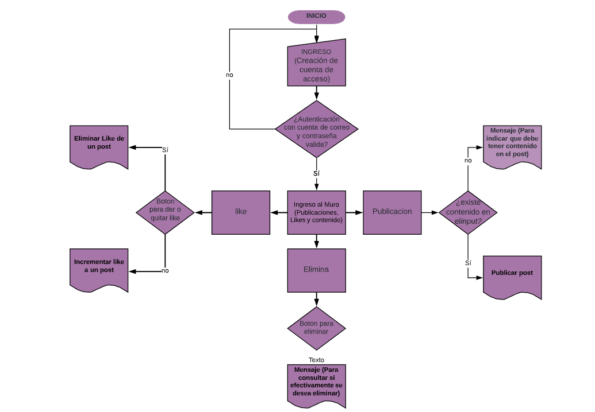
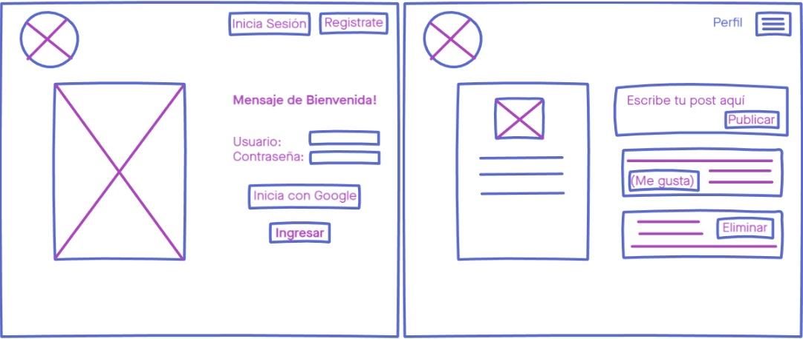

# Red Social Women Today

## Índice

* [1. Preámbulo](#1-preámbulo)
* [2. Objetivo del proyecto](#2-objetivo-del-proyecto)
* [3. Planificación](#3-planificación)
* [4. Enfoque de Usuario](#4-enfoque-de-usuario)
* [5. Proceso de Diseño (Prototipado)](#4-proceso-de-diseño )
* [6. Diseño de Interfaz](#6-diseño-de-interfaz)
* [7. Testeos de Usabilidad](#7-testeos-de-usabilidad)
* [8. Conclusiones](#7-conclusiones)

***
# 1. Preámbulo :mag:

Women today, es una comunidad virtual abierta, donde convergen mujeres emprendedoras y exponen sus habilidades, talento y conocimiento, con ganas de superarse y fortalecer su autonomía económica. ¡Únete a nostras y atrevete a inventar tu propio camino! 

## 2. Objetivo del proyecto :pencil:

Se desarrollara una red social, Single-Page Application (SPA), responsiva en la que se podra publicar, leer, actualizar y eliminar datos permitiendo a nuestras usuarias compartir con otras mujeres, todo tipo de ideas, ofertas y emprendimientos, donde pueden encontrar la mejor opción para cada una sin usar su tiempo libre recorriendo la ciudad para mostrar sus sueños y/o buscar oportunidades. 

## 3. Planificación :pencil:

La planificación de nuestra red social esta realizada en Trello.
Para acceder [Haz click aqui] (https://trello.com/b/1YBjbr5a/red-social)

## 4. Enfoque de Usuario :busts_in_silhouette:

| Historias de Usuarios                                                                                                                                                   | Criterio de Aceptación                                                                                                                                                     | Criterios de Terminado                                                              |
|-------------------------------------------------------------------------------------------------------------------------------------------------------------------------|----------------------------------------------------------------------------------------------------------------------------------------------------------------------------|-------------------------------------------------------------------------------------|
| Historia de Usuario N°1 Yo como nuevo usuario, Quiero crearme una cuenta, Para ingresar a la red social                                                                 | Dado que usuario nuevo ingrese sus datos para registrarme, Cuando carga la interfaz, Entonces ingreso a la red social                                                      | El nuevo usuario puede ingresar a la red social y ver las publicaciones             |
| Historia de Usuario N°2 Yo como Usuario Registrado, Quiero ingresar mis datos, Para acceder a mi perfil personalizado                                                   | Dado que el usuario ingrese sus datos, Cuando inicie su sesión, Entonces tendrá acceso a su perfil en la red social                                                        | El usuario puede ingresar a la red social y tener un perfil personalizado           |
| Historia de Usuario N°3 Yo como usuario registrado en la Red, Quiero Poder realizar una publicación, Para Mostrar a las personas de la comunidad mis ideas.             | Dado que el usuario realiza una publicación, Cuando cuando el usuario haga clic en el botón publicar, Entonces: La publicación de se muestra en la pagina principal        | La publicación puede ser vista por todos los usuarios registrados de la Red social. |
| Historia de Usuario N°4 Yo como usuario, Quiero Poder dar y quitar like a una publicación, Para tener interacción de mis publicaciones con otros usuarios               | Dado: El usuario da o quita like a una publicación, Cuando Carga la interfaz, Entonces El like se suma o se resta a los like de la publicación.                            | La publicación muestre la suma o resta del like.                                    |
| Historia de Usuario N°5 Yo como usuario publique un post, Quiero Editar publicación realizada, Para agregar o eliminar ideas.                                           | Dado  El usuario modifico el post, Cuando el usuario da clic al botón publicar y carga la interfaz, Entonces La publicación se muestra en la pagina principal.             | Todos lo usuarios de la pagina pueden visualizar la publicación editada.            |
| Historia de Usuario N°6 Yo como usuario realizo una publicación, Quiero Eliminar una publicación, Para que desaparezca del muro mi publicación                          | Dado que el usuario Elimino la publicación, Cuando El usuario da click al botón eliminar y carga la interfaz, Entonces La publicación quedara eliminada.                   | Ca publicación es eliminada  de la red social.                                      |
| Historia de Usuario N°7 Yo como usuario, Quiero tener acceso a la RRSS en cualquier dispositivo, Para Visualizar mi contenido de manera cómoda desde Móvil, Tablet o Pc | Dado que el usuario ya esta registrado, Cuando acceda desde cualquier dispositivo, Entonces podrá visualizar la red social desde cualquier dispositivo (Móvil, Tablet, Pc) | El usuario visualiza la red social desde cualquier dispositivo (Móvil, Tablet, Pc)  |

## 5. Proceso de Diseño (Prototipado) :pencil2::

⦁	Flujograma realizado para la organización y estructura de nuestro sitio web:

⦁	Boceto de prototipo de baja fidelidad en lápiz y papel:

Para realizar este primer prototipo nos enfocamos en los aspectos mas relevantes para los usuarios, plasmando lo que buscarian en nuestra web/app. Una vez identificado esto, distribuimos la informacion de manera practica en lo visual.

⦁ Prototipo de baja fidelidad:

En este diseño de Interfaz de Usuario se utilizó Invision como herramienta de diseño visual, puedes verlo a traves de nuestro [link](https://notificaciones.invisionapp.com/overview/Red-Social-ckan2705v0tw101bkvg9656vk/screens?v=i%2FW%2FrVdbu8slVKCxNbvdow%3D%3D&linkshare=urlcopied).Foto de referencia de nuestro prototipo de baja fidelidad.

 
⦁ Prototipo de alta fidelidad:

En espera de feedback.

## 6. Diseño de Interfaz :computer:

## 7. Testeos de Usabilidad :busts_in_silhouette:

## 8. Conclusiones :clipboard:

### HTML y CSS

* [ ] [HTML semántico](https://developer.mozilla.org/en-US/docs/Glossary/Semantics#Semantics_in_HTML)
* [ ] [CSS `flexbox`](https://css-tricks.com/snippets/css/a-guide-to-flexbox/)
* [ ] Construir tu aplicación respetando el diseño realizado (maquetación).

### DOM y Web APIs

* [ ] [Manipulación dinámica del DOM](https://developer.mozilla.org/es/docs/Referencia_DOM_de_Gecko/Introducci%C3%B3n)
* [ ] [History API](https://developer.mozilla.org/es/docs/DOM/Manipulando_el_historial_del_navegador)
* [ ] [`localStorage`](https://lms.laboratoria.la/cohorts/scl-2020-03-bc-core-scl013/courses/browser/03-browser-apis/03-web-storage)

### Javascript

* [ ] [Uso de callbacks](https://developer.mozilla.org/es/docs/Glossary/Callback_function)
* [ ] [Consumo de Promesas](https://scotch.io/tutorials/javascript-promises-for-dummies#toc-consuming-promises)
* [ ] Uso ES modules
([`import`](https://developer.mozilla.org/en-US/docs/Web/JavaScript/Reference/Statements/import)
| [`export`](https://developer.mozilla.org/en-US/docs/Web/JavaScript/Reference/Statements/export))

### Firebase

* [ ] [Firestore](https://firebase.google.com/docs/firestore)
* [ ] [Firebase Auth](https://firebase.google.com/docs/auth/web/start)
* [ ] [Firebase security rules](https://firebase.google.com/docs/rules)
* [ ] [Uso de onSnapshot](https://firebase.google.com/docs/firestore/query-data/listen)
| [onAuthStateChanged](https://firebase.google.com/docs/auth/web/start#set_an_authentication_state_observer_and_get_user_data)

### Testing

* [ ] [Testeo de tus funciones](https://jestjs.io/docs/es-ES/getting-started)
* [ ] [Testeo asíncrono](https://jestjs.io/docs/es-ES/asynchronous)
* [ ] [Mocking](https://jestjs.io/docs/es-ES/manual-mocks)

### Git y Github

* [ ] Colaboración en Github
* [ ] Organización en Github

### Buenas prácticas de desarrollo

* [ ] Modularización
* [ ] Nomenclatura / Semántica
* [ ] Linting